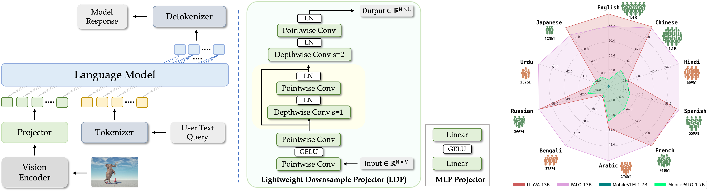
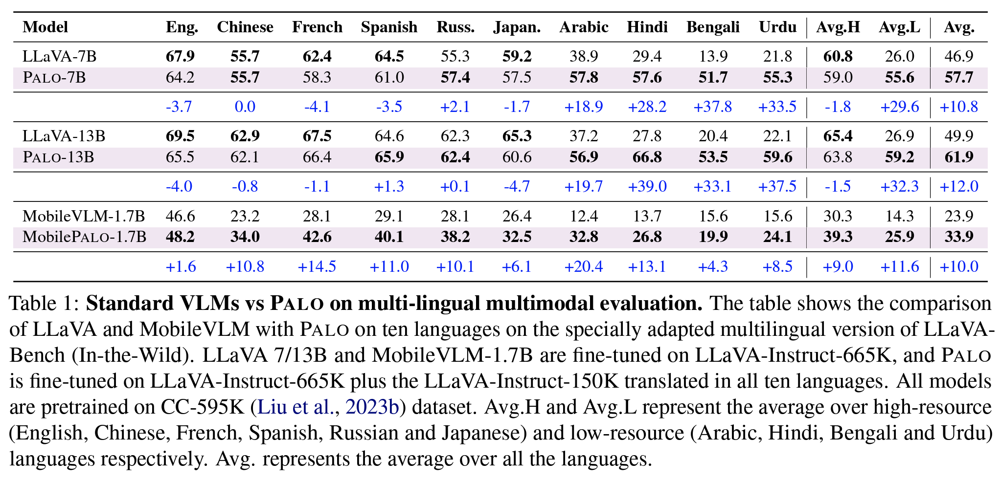

# 🌍 PALO: A Polyglot Large Multimodal Model for 5B People (WACV 2025)

<p align="center">
    
</p>

#### [Hanoona Rasheed](https://www.hanoonarasheed.com/), [Muhammad Maaz](https://www.muhammadmaaz.com), [Abdelrahman Shaker](https://amshaker.github.io), [Salman Khan](https://salman-h-khan.github.io/), [Hisham Cholakkal](https://scholar.google.ae/citations?user=bZ3YBRcAAAAJ&hl=fr), [Rao M. Anwer](https://scholar.google.fi/citations?user=_KlvMVoAAAAJ&hl=en), [Timothy Baldwin](https://eltimster.github.io/www), [Michael Felsberg](https://people.isy.liu.se/cvl/mfe/) and [Fahad Khan](https://sites.google.com/view/fahadkhans/home)

### Vision-language conversation in 10 languages including English, Chinese, French, Spanish, Russian, Japanese, Arabic, Hindi, Bengali and Urdu

[](https://palo.mbzuai-oryx.ngrok.app)
[](https://arxiv.org/abs/2402.14818)
[](https://huggingface.co/datasets/MBZUAI/palo_multilingual_dataset)

---

## 📢 Latest Updates
- **Aug-30-24**: PALO has been accepted at WACV 2025. 🔥🔥
- **Mar-25-24**: PALO training and evaluation codes, and pretrained checkpoints are released. 🔥🔥
- **Mar-03-24**: PALO multi-lingual evaluation dataset is released. Check it out at [MBZUAI/multilingual-llava-bench-in-the-wild](https://huggingface.co/datasets/MBZUAI/multilingual-llava-bench-in-the-wild). 🔥🔥
- **Feb-27-24**: PALO multi-lingual training dataset is released. Check it out at [MBZUAI/palo_multilingual_dataset](https://huggingface.co/datasets/MBZUAI/palo_multilingual_dataset). 🔥🔥
- **Feb-23-24**: PALO paper and online demo are released. Code, pretrained models and training/evaluation scripts are coming soon!

---

## Overview

In pursuit of more inclusive Vision-Language Models (VLMs), this study introduces a Large Multilingual Multimodal Model called PALO. PALO offers visual reasoning capabilities in 10 major languages, including English, Chinese, Hindi, Spanish, French, Arabic, Bengali, Russian, Urdu, and Japanese, that span a total of ~5B people (65% of the world population).


<p align="center">
  
</p>


## 🏆 Contributions
1. We develop Palo: **the first multilingual Large Multimodal Model (LMM)**, capable of generating responses in **10 languages**.
2. We created an extensive multilingual instruction-tuning dataset (~2.1M instructions) by translating LLaVA-Instruct-150K.
3. We train models across three distinct scales i.e., 1.7B, 7B, and 13B parameters to demonstrate the scalability of our training pipeline. The models demonstrate good performance on low-resource languages, e.g., Hindi, Arabic, Bengali, and Urdu, without compromising its high-performance on high-resource languages e.g., English, Chinese, French, and Spanish.


## 📂 PALO Multi-Lingual Dataset Access
We develop a diverse instruction set (~2.1M instructions) comprising conversations from ten  languages. Specifically, 665K instructions from LLaVA-Instruct-665K are used for English, and approximately 150K conversations from LLaVA-Instruct-150K are translated to Chinese, French, Spanish, Russian, Japanese, Arabic, Hindi, Bengali and Urdu using our proposed semi-automated translation pipeline.

📥 **Download the Training Dataset:** Access our multi-lingual dataset on Hugging Face: [MBZUAI/palo_multilingual_dataset](https://huggingface.co/datasets/MBZUAI/palo_multilingual_dataset).

We also develop a multi-lingual evaluation set to conduct a comprehensive evaluation across various languages. This set is constructed by translating the LLaVA-Bench  into all target languages using GPT-4-Turbo, with particular attention to preserving linguistic authenticity and mitigating common issues of automated translations through careful human correction.

📥 **Download the Evaluation Dataset:** Access our multi-lingual evaluation dataset on Hugging Face: [MBZUAI/MBZUAI/multilingual-llava-bench-in-the-wild](https://huggingface.co/datasets/MBZUAI/multilingual-llava-bench-in-the-wild).


## 🧠 Model Zoo
| Model Name       | HuggingFace Link                                     |
|------------------|------------------------------------------------------|
| MobilePALO-1.7B  | [MBZUAI/MobilePALO-1.7B](https://huggingface.co/MBZUAI/MobilePALO-1.7B) |
| PALO-7B          | [MBZUAI/PALO-7B](https://huggingface.co/MBZUAI/PALO-7B)   |
| PALO-13B         | [MBZUAI/PALO-13B](https://huggingface.co/MBZUAI/PALO-13B) |


## 🔧 Installation
We recommend setting up a conda environment for the project:

```bash
conda create --name=palo python=3.10
conda activate palo

git clone https://github.com/mbzuai-oryx/PALO
cd PALO

pip install -r requirements.txt
pip instal flash-attn==2.3.2

export PYTHONPATH="./:$PYTHONPATH"
```

## 💿 Running Demo Offline
Please follow the instructions below to run the PALO demo on your local GPU machine.

**1. Launch a controller**

```bash
python palo/serve/controller.py --host 0.0.0.0 --port 10000

```

**2. Launch a gradio web server.**
```bash
python palo/serve/gradio_web_server.py --controller http://localhost:10000 --model-list-mode reload

```
**3. Launch a model worker**
```bash
python palo/serve/model_worker.py --host 0.0.0.0 --controller http://localhost:10000 --port 40000 --worker http://localhost:40000 --model-path MBZUAI/PALO-13B
```

You can launch as many workers as you want, and compare between different model checkpoints in the same Gradio interface. Please keep the `--controller` the same, and modify the `--port` and `--worker` to a different port number for each worker.

## 🚋 Training
**1. Prepare data**

Please download the annotations from [MBZUAI/palo_multilingual_dataset](https://huggingface.co/datasets/MBZUAI/palo_multilingual_dataset) and all images following the below links.


- COCO: [train2017](http://images.cocodataset.org/zips/train2017.zip)
- GQA: [images](https://downloads.cs.stanford.edu/nlp/data/gqa/images.zip)
- OCR-VQA: [download script](https://drive.google.com/drive/folders/1_GYPY5UkUy7HIcR0zq3ZCFgeZN7BAfm_?usp=sharing),
- TextVQA: [train_val_images](https://dl.fbaipublicfiles.com/textvqa/images/train_val_images.zip)
- VisualGenome: [part1](https://cs.stanford.edu/people/rak248/VG_100K_2/images.zip), [part2](https://cs.stanford.edu/people/rak248/VG_100K_2/images2.zip)

After downloading all of them, organize the data as follows in `./playground/data`,

```
data
    ├── coco
    │   └── train2017
    ├── gqa
    │   └── images
    ├── ocr_vqa
    │   └── images
    ├── textvqa
    │   └── train_images
    └── vg
        ├── VG_100K
        └── VG_100K_2
    ├── palo_multilingual_dataset
        ├── palo_multilingual_dataset.json
```

Please note that all images should be in the `.jpg` format.

**2. Download Pretrained Projection Weights**

| Model Name       | Projector Weights                                                       |
|------------------|-------------------------------------------------------------------------|
| MobilePALO-1.7B  | [MBZUAI/palo_1.7B_stage1_mm_projector](https://huggingface.co/MBZUAI/palo_1.7B_stage1_mm_projector) |
| PALO-7B          | [liuhaotian/llava-v1.5-mlp2x-336px-pretrain-vicuna-7b-v1.5](https://huggingface.co/liuhaotian/llava-v1.5-mlp2x-336px-pretrain-vicuna-7b-v1.5)                 |
| PALO-13B         | [liuhaotian/llava-v1.5-mlp2x-336px-pretrain-vicuna-13b-v1.5](https://huggingface.co/liuhaotian/llava-v1.5-mlp2x-336px-pretrain-vicuna-13b-v1.5)               |

**3. Run Training**

```bash
# For MobilePALO-1.7B
bash scripts/train/finetune_palo.sh "mtgv/MobileLLaMA-1.4B-Chat" "data/palo_multilingual_dataset/palo_multilingual_dataset.json" <path to palo_1.7B_stage1_mm_projector.bin> "ldpnet" "results/PALO-1.7B" "2" "2e-5"

# For PALO-7B
bash scripts/train/finetune_lora_palo.sh "lmsys/vicuna-7b-v1.5" "data/palo_multilingual_dataset/palo_multilingual_dataset.json" <path to llava-v1.5-mlp2x-336px-pretrain-vicuna-7b-v1.5.bin> "mlp2x_gelu" "results/PALO-7B" "3" "2e-4"

# For PALO-13B
bash scripts/train/finetune_lora_palo.sh "lmsys/vicuna-13b-v1.5" "data/palo_multilingual_dataset/palo_multilingual_dataset.json" <path to llava-v1.5-mlp2x-336px-pretrain-vicuna-13b-v1.5.bin> "mlp2x_gelu" "results/PALO-13B" "3" "2e-4"
```

## 📊 Quantitative Evaluation
Please download PALO multi-lingual evaluation data from [MBZUAI/MBZUAI/multilingual-llava-bench-in-the-wild](https://huggingface.co/datasets/MBZUAI/multilingual-llava-bench-in-the-wild) and arrange it as follows,

```
data
    ├── multilingual-llava-bench-in-the-wild 
        ├── arabic
            ├── question.jsonl
            ├── answers.jsonl
            ├── context.jsonl
        ├── bengali
            ├── question.jsonl
            ├── answers.jsonl
            ├── context.jsonl
        ...
        ...
        ...
```
Use the following scripts to perform evaluation,

```bash
bash scripts/eval/eval_all_languages.sh <path to the trained model> <Output file name> <OpenAI API Key>
```

<p align="center">
  
</p>

## 📚 Qualitative Examples of Multilingual Capabilities

<p align="center">
  
</p>

<p align="center">
  
</p>

## 📜 Citation
```bibtex

    @inproceedings{PALO,
        title={Palo: A Large Multilingual Multimodal Language Model},
        author={Rasheed, Hanoona and Maaz, Muhammad and Shaker, Abdelrahman and Khan, Salman and Cholakal, Hisham and Anwer, Rao M. and Baldwin, Tim and Felsberg, Michael and Khan, Fahad S.},
        booktitle={Proceedings of the IEEE/CVF Winter Conference on Applications of Computer Vision (WACV 2025)},
        year={2025}
    }
```
